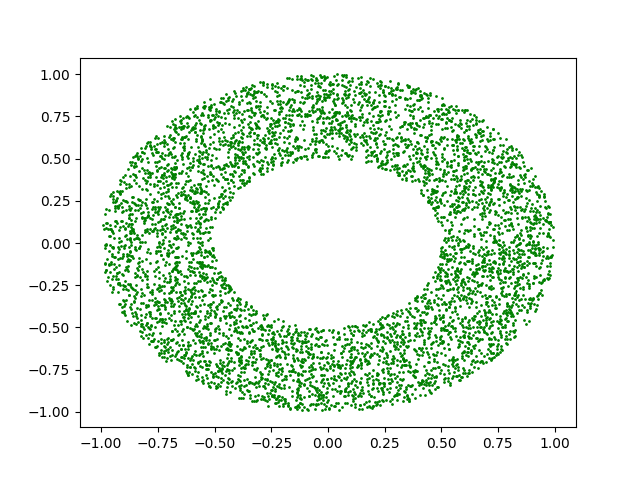
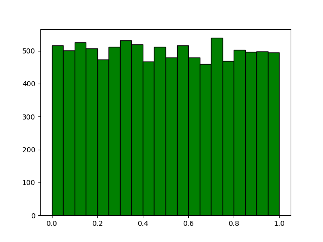
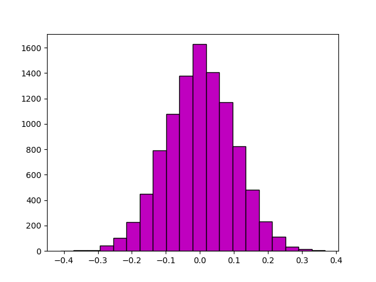
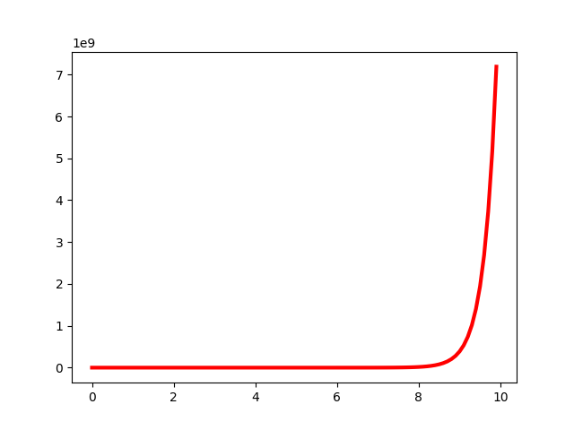
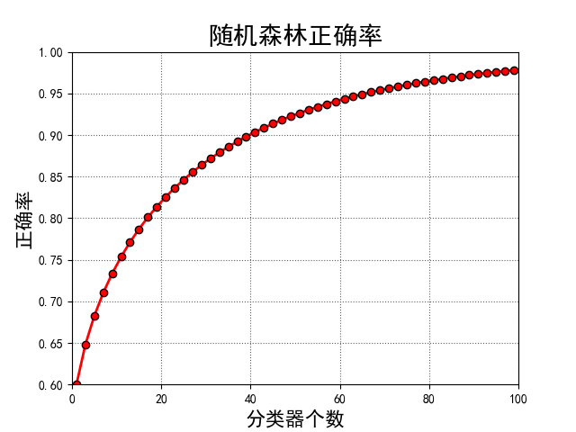
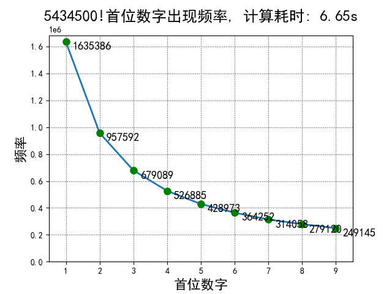
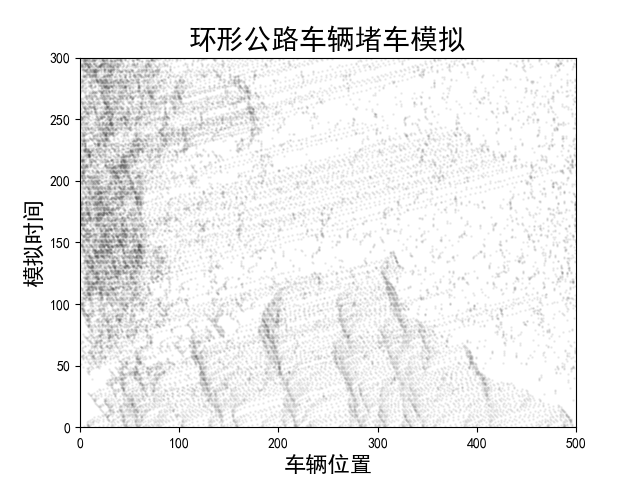

# 学习笔记

## 初识python

### matplotlib

#### 线条颜色

```python
b: 蓝色
g: 绿色
r: 红色
c: 青色
m: 品红
y: 黄色
k: 黑色
w: 白色
```

#### 线条样式

```python
- 实线
-- 破折线，也称为虚线
-. 点划线
: 细小点线
. 点标记
, 像素标记（很小的点）
o 圆圈标记
v 下三角标记
^ 上三角标记
< 左三角标记
> 右三角标记
1 下三叉戟标记
2 上三叉戟标记
3 左三叉戟标记
4 右三叉戟标记
s 正方形标记
p 五边形标记
* 星号标记
h 六边形标记1
H 六边形标记2
+ 加号标记
x 乘号标记
D 菱形标记
d 细小菱形标记
| 垂直线标记
_ 水平线标记
```

### 绘制一个空心圆

```python
# -*- coding: utf8 -*-
import numpy as np
import matplotlib.pyplot as plt


def main():
    print('Hello World')
    x = 2 * np.random.rand(10000, 2) - 4
    # print(x)
    # print(x[1])
    # print(x[:, 1])
    lx = x[:, 0]
    ly = x[:, 1]
    # 小于比较
    idx = lx ** 2 + ly ** 2 < 1
    hole = lx ** 2 + ly ** 2 <= 0.25
    idx = np.logical_and(idx, ~hole)  # [True false ... True True]
    """
    # 数据清洗
    lx[lx < 0.5] = 0.5
    """
    # print(idx)
    plt.plot(lx[idx], ly[idx], 'go', markersize=1)
    plt.savefig(fname='test1.png')
    plt.show()


if __name__ == '__main__':
    main()

```


### 均匀分区迭代后是高斯分布（正态分布）

> 验证中心极限定理

```python
# -*- coding: utf8 -*-
import numpy as np
import matplotlib.pyplot as plt


def main():
    p = np.random.rand(10000)
    # bins: 等分为20份
    # color: 填充的颜色
    # edgecolor: 边界线的颜色【b: 蓝色 g: 绿色 r: 红色 c: 青色 m: 品红 y: 黄色k: 黑色 w: 白色】
    plt.hist(p, bins=20, color='g', edgecolor='k')
    plt.savefig(fname='test2_1.png')
    plt.show()

    # ignore pep8
    N = 10000
    times = 100
    z = np.zeros(N)
    for i in range(times):
        z += np.random.randn(N)

    z /= times
    plt.hist(z, bins=20, color='m', edgecolor='k')
    plt.savefig(fname='test2_2.png')
    plt.show()


if __name__ == '__main__':
    main()

```

1. 均匀分布



2. 高斯分布



### np与pd的转换

```python
# -*- coding: utf8 -*-
import numpy as np
import pandas as pd


def main():
    d = np.random.rand(3, 4)
    print(d)
    data = pd.DataFrame(data=d, columns=['a', 'b', 'c', 'd'])
    print(data)
    print(data[['a', 'b']])
    data.to_csv('test3.csv', index=False, header=True)


if __name__ == '__main__':
    main()

```

#### y = x^x绘制

```python
# -*- coding: utf8 -*-
import numpy as np
import matplotlib.pyplot as plt


def main():
    x = np.arange(0, 10, .1)
    y = x ** x
    plt.plot(x, y, 'r-', lw=3)
    plt.savefig('test4.png')
    plt.show()


if __name__ == '__main__':
    main()

```




### 随机森林预测正确的概率

```python
# -*- coding: utf8 -*-
from scipy.special import comb
import numpy as np
import matplotlib.pyplot as plt
import matplotlib as mpl


def get_bagging(n, p):
    """
    获取正确的概率
    :param n:
    :param p:
    :return:
    """
    s = 0
    for i in range(n // 2 + 1, n + 1):
        s += comb(n, i) * p ** i * (1 - p) ** (n - i)
    return s


def main():
    p = 0.6
    n = 100
    x = np.arange(1, n, 2)
    y = np.empty_like(x, dtype='double')
    for i, t in enumerate(x):
        bagging = get_bagging(t, p)
        if t % 10 == 9:
            print(f'{t}: {bagging}')
        y[i] = bagging
    mpl.rcParams['font.sans-serif'] = 'simHei'
    mpl.rcParams['axes.unicode_minus'] = False
    plt.figure(facecolor='w')
    plt.plot(x, y, 'ro-', lw=2, mec='k')
    plt.xlim(0, n)
    plt.ylim(0.6, 1)
    plt.xlabel('分类器个数', fontsize=16)
    plt.ylabel('正确率', fontsize=16)
    plt.title('随机森林正确率', fontsize=20)
    plt.grid(visible=True, ls=':', color='#606060')
    plt.savefig('test5.png')
    plt.show()


if __name__ == '__main__':
    main()

```



## 概率初识

### 9点问题

#### 本福特定律

> 本福特定律（Benford's Law），也称为首位数字定律或显著数字定律，是一个关于在许多自然集合和统计数据集中，较小的首位数字出现的频率意外地高的观察现象。具体来说，本福特定律指出，在许多自然发生的数集中，首位数字为1的数比首位数字为2的数更常见，首位数字为2的数又比首位数字为3的数更常见，以此类推，直到首位数字为9的数最不常见。
>
> 本福特定律的数学表达式是：
>
> [ P(d) = \log_{10}\left(d+1\right) - \log_{10}(d) = \log_{10}\left(\frac{d+1}{d}\right) ]
>
> 其中 ( P(d) ) 是首位数字为 ( d ) 的数出现的概率，( d ) 可以是1到9的任意整数。根据本福特定律，首位数字为1的数出现的概率约为30.1%，而首位数字为9的数出现的概率约为4.6%。
>
> 这个定律适用于很多不同类型的数据集，包括经济数据、河流长度、国家人口数、死亡率数据等等。但它并不适用于所有数据集，比如电话号码、邮编或者由人为制定的数字序列通常不遵循本福特定律。

#### 实现代码

```python
# -*- coding: utf8 -*-
"""
九点分布
计算N的阶乘首位数字出现的概率
方法:
1. N! = 10 ^(log 10 N!) = 10^(log10 N + log 10 (N-1) + ... + log 10 1)
2. 10^2.1 = 10 ^ 2 x 10^0.1 = 100 x 10^0.1
3. 100 x 10^0.1的数位数字为int(10^0.1)
"""
import numpy as np
import matplotlib.pyplot as plt
import matplotlib as mpl
from time import time


def get_first_digital(num):
    num -= int(num)
    return int(10 ** num)


def main():
    """
    1. 计算log 10 N!
    2. 计算10^(log 10 N!)=int(10^(log10 N!(去除整数)))
    :return:
    """
    N = 5434500
    x = np.arange(1, N + 1, 1)
    frequency = [0] * 9

    t0 = time()
    # 1. 计算log10 N!
    y = np.cumsum(np.log10(x))
    # 2. 计算int(10 ^ (y -= int(y)))
    for s in y:
        frequency[get_first_digital(s) - 1] += 1
    t1 = time()

    print(f'计算耗时: {t1 - t0}s')

    # 渲染
    mpl.rcParams['font.sans-serif'] = 'simHei'
    mpl.rcParams['axes.unicode_minus'] = False
    plt.plot(np.arange(1, 10), frequency, np.arange(1, 10),
             frequency, 'go', lw=2, markersize=8)
    for x, y in enumerate(frequency):
        plt.text(x + 1.2, y, frequency[x], verticalalignment='top', fontsize=13)
    plt.title('{}!首位数字出现频率, 计算耗时: {:.2f}s'.format(N, t1 - t0), fontsize=18)
    plt.xlim(0.5, 9.5)
    plt.ylim(0, max(frequency)*1.03)
    plt.xlabel('首位数字', fontsize=16)
    plt.ylabel('频率', fontsize=16)
    plt.grid(visible=True, ls=':', color='#404040')
    plt.savefig('img/test1.png')
    plt.show()
    pass


if __name__ == '__main__':
    main()

```



### Nagel-Schreckenberg交通流模型

```python
# -*- coding: utf8 -*-
"""
Nagel-Schreckenberg交通流模型
路面上有N辆车，以不同的速度向前行驶，模拟堵车问题。有以下假设:
1. 假设某辆车的当前速度是v
2. 若前方可见范围内没车，则它在下一秒的车速提高到v+1，直到达到规定的最高限速
3. 若前方有车，前车的距离为d，且d<v，则它下一秒的车速降低到d - 1
4. 每辆车会以概率p随机减速v-1
"""
import numpy as np
import matplotlib.pyplot as plt
import matplotlib as mpl


def main():
    path = 500  # 距离
    n = 100  # 车辆数
    v_max = 5  # 最大速度
    p = 0.3  # 减速概率
    times = 300
    np.random.seed(0)
    x = np.sort(np.random.rand(n) * path)  # 车辆的初始位置
    v = np.ones(n) * v_max  # 所有车辆的初始速度设置为最大速度

    # 记录车辆位置的矩阵，用于后续的可视化
    X = np.zeros((times, n))

    for t in range(times):
        for i in range(n):
            # 计算前车的距离
            if i == n - 1:  # 处理环形道路的最后一辆车
                d = x[0] - x[i] + path
            else:
                d = x[i + 1] - x[i]

            # 规则1: 加速
            if v[i] < v_max:
                v[i] += 1

            # 规则2: 减速避免碰撞
            if d <= v[i]:
                v[i] = d - 1

            # 规则3: 随机减速
            if np.random.rand() < p:
                v[i] = max(v[i] - 1, 0)

        # 更新车辆位置
        x = (x + v) % path

        # 记录位置
        X[t] = x

        # 观察车辆位置
        plt.scatter(x, [t] * n, s=1, c='k', alpha=0.05)

    mpl.rcParams['font.sans-serif'] = ['SimHei']
    mpl.rcParams['axes.unicode_minus'] = False
    # plt.figure(figsize=(8, 6), facecolor='w')
    plt.xlim(0, path)
    plt.ylim(0, times)
    plt.xlabel(u'车辆位置', fontsize=16)
    plt.ylabel(u'模拟时间', fontsize=16)
    plt.title(u'环形公路车辆堵车模拟', fontsize=20)
    # plt.tight_layout(pad=2)
    plt.savefig('img/test2.png')
    plt.show()


if __name__ == '__main__':
    main()

```


